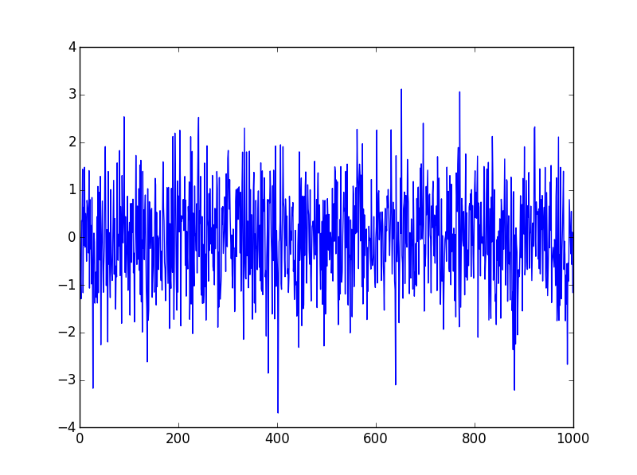
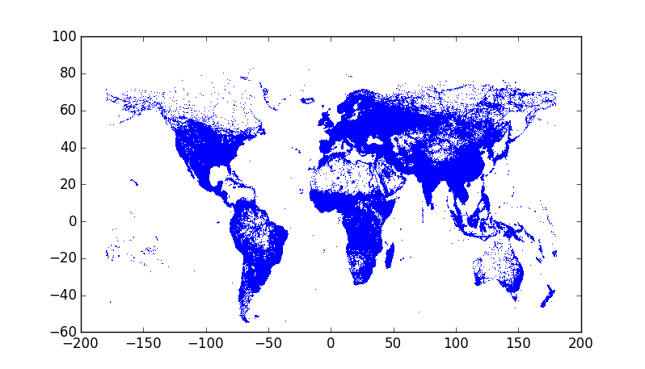

# 4.1 使用Matplotlib绘图

Python界不缺少绘图包，目前应用最广泛的还是Matplotlib。Matplotlib不仅可用作可视化和高质量图形生成，与IPython的集成也非常之好。

## 4.1.1 配置IPython

IPython实现了**事件循环集成系统**（event loop integration system），从而可以在不阻塞控制台的前提下，在命令行调整图形显示。以后你会了解到这一点多么有用。

### 配置与选项

要激活上述循环集成系统，可使用%pylab命令或--pylab选项。--pylab选项还可指定后端展现方式，如--pylab qt。若在脚本中使用Matplotlib，按惯例一般这样引用：

```
import matplotlib.pyplot as plt
```

在脚本执行时，在show函数调用时，图形才会显示，而在IPython命令行下，图形的显示是即时的。

### 交互式导航

在Matplotlib图形显示时，可看到若干导航按钮。

### 在IPython notebook中使用

在加载notebook时，使用选项：

```
ipython notebook --pylab inline
```

或在开始处执行：%pylab inline。

## 4.1.2 标准绘图功能

这一节将介绍Matplotlib的基本绘图功能，如直线、曲线、散点图、柱状图等。下一节我们会看到图像和地图方面的功能。但Matplotlib的功能远不限于这些，还要你多多发现和挖掘。

### 绘制曲线

在绘制函数曲线时，需要自变量和因变量的值。不过对于plot函数来说，只要y就可以绘图了：

```
In [1]: y = randn(1000)
In [2]: plot(y)
# [<matplotlib.lines.Line2D at 0x9decd68>]
```



### 散点图

```
import pandas as pd
cd data
filename = 'worldcitiespop.txt'
data = pd.read_csv(filename, low_memory=False)
plot(data.Longitude, data.Latitude, ',')
# [<matplotlib.lines.Line2D at 0x2b86fb70>]
```



这里通过城市的经纬度来绘制出散点图，看起来就是一副有点酷的世界地图。如果仔细检查，会发现这个地图比例有点失真，因为我们使用的笛卡尔坐标系，后面会介绍如何使用地图投影方法。


### 直方图

```
import networkx as nx
g = nx.read_edgelist('0.edges')
hist(g.degree().values(), bins=20)
```

要了解Matplotlib的更多功能和示例，看看它的[Gallery页面](http://matplotlib.org/gallery.html)，以及Nicolas Rougier的[教程](http://www.labri.fr/perso/nrougier/teaching/matplotlib/matplotlib.html)。

## 4.1.3 自定义绘图

### 样式和颜色

在同时显示多个图形时，最好使用不同的样式和颜色。plot函数的第三个参数，使用一种非常简单的“语法”指定样式和颜色，如果你用过matlab或R，那么会觉得这种语法很熟悉。

'-r'表示continuous and red；'--g'表示dashed and green；','表示像素等等，总共有数十种样式争夺，总有一款适合你。

对于颜色，rgb是三种基本颜色，还有c(yan)、m(agenta)和y(ellow)，k（black）和w（white）。还可以使用RGB和RGBA来指定颜色。

在同时显示多个图形时，每个图形的颜色通过预定义的一组颜色来设定，这个也是可以自定义的：

```
rcParams['axes.color_cycle'] = ['r', 'k', 'c']
```


